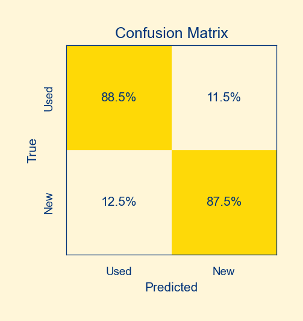
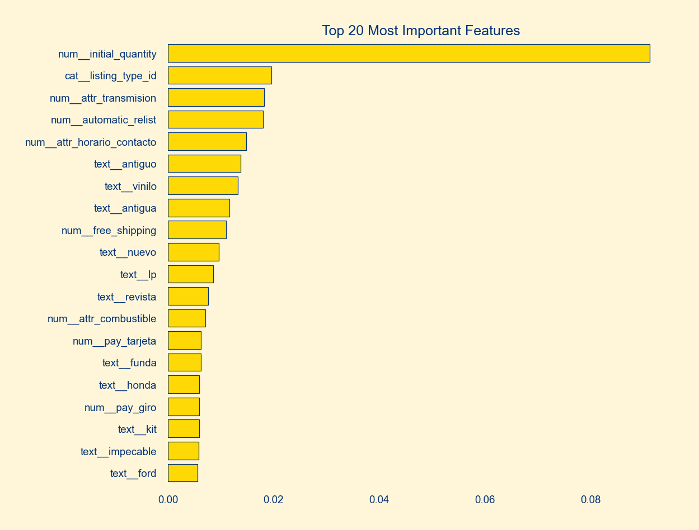

<h1 align="center">Items Condition Prediction</h1>

<p align="center">
  
  
  
  
</p>

## Why

In the context of Mercado Libre's marketplace, an algorithm is needed to predict if an item listed in the marketplace is new or used.

This algorithm will help improve the user experience while searching and shopping, because they will know with confidence the condition of their items. And besides that, this could help reduce the cost of returns and chargebacks.

### Why now

The algorithm is needed now because the marketplace is growing and the number of items listed is increasing. This makes it difficult for users to find what they are looking for, and it is important to provide them with the best experience possible.

## Metrics

To evaluate use the standard **accuracy** because the dataset is almost balanced, and the classes are equally important.

As a secondary metric, we will use the **precision**, which is the proportion of true positive predictions among all positive predictions.

The rationale behind this choice is that we want to minimize the number of false positives, i.e., the number of items that are predicted as new but are actually used.

## Results summary

The results of the training-evaluation pipeline are summarized in the table below.

| Model         | Features                  | Accuracy  | Precision |
|---------------|---------------------------|-----------|-----------|
| Naive Bayes   | Title text                | 80.3%     | 78.9%     |
| Random Forest | Tabular data              | 85.7%     | 87.9%     |
| XGBoost       | Title text + tabular data | **88.0%** | **90.0%** |

The `XGBoost` model performed the best, with an accuracy of 88% and a precision of 90%. The model was able to predict the class of the items with a high accuracy and precision.

This is the confusion matrix of the `XGBoost` model:




### Feature importances

The feature importances of the `XGBoost` model are shown in the plot below.



The most important features were the item's initial quantity, the seller's reputation/maturity, and the item's title. Besides that, the quality of the item's pictures and some attributes attached to the listing were also important.

### Potential next iterations

Here are some ideas to further improve the model:

- Try to improve the models by tuning the hyperparameters and using a stacking method.
- Use how many items a seller has sold in the past as a feature.
- Use the item's description as a feature too, which is not present in the current data.
- Compute a new feature to indicate how far away is the price from the average price of the same category (or even the same produt), which could be a good indicator of the item's condition.
- Use better text preprocessing techniques, such as transformer-based embeddings or text classification using LLMs.

## Running instructions

### Environment

First, clone the repository and install all dependencies.

```bash
git clone https://github.com/dewith/new-or-used.git
make install
make pre-commit
source .env/bin/activate
```

### Dataset

Download the raw data from [here](https://drive.google.com/file/d/1Iphj_MD5LJP7pkxYs14wQ3xW38T5DOy0/).

You should save the raw file at `data/01_raw/MLA_100k_checked_v3.jsonlines`.

### Execution

Finally, you can run the training-evaluation pipeline located on `src/main.py`.

```bash
python -m src.main
```

You should see the following output in the terminal:

```bash
| DATA PREPROCESSING 💽
| Train-test splitting
|     Reading data from data/01_raw/MLA_100k_checked_v3.jsonlines
|         Dataset contains 100,000 items
|         Train/test sets contain 90,000/10,000
|     Writing train and test data
|     Done
| Preprocessing data sets
|     Loading data
|         Train set shape: (90000, 45)
|         Test set shape: (10000, 45)
|     Mapping target label to {'used': 0, 'new': 1}
|         Proportion of each class: {1: 0.537, 0: 0.463}
|     Fitting preprocessor
|         Keeping 62 attributes
|         Keeping 42 categories
|     Transforming data
|         Train set
|             Processing dict columns
|             Processing list columns
|             Processing categorical columns
|             Processing numerical columns
|             Processing boolean columns
|         Test set
|             Processing dict columns
|             Processing list columns
|             Processing categorical columns
|             Processing numerical columns
|             Processing boolean columns
|     Saving preprocessed data
|     Writing preprocessor class with pickle
|     Done
| ML MODELING 🤖
| Training model with cv = 5
|     Loading data
|     Building preprocessors
|     Building pipeline
|     Performing cross-validation score
|     Performing cross-validation predict:
|         Cross-validation metrics:
|             test_accuracy    0.8806 ± 0.0013
|             test_precision   0.9012 ± 0.0025
|             test_recall      0.8736 ± 0.0022
|             test_f1_score    0.8872 ± 0.0011
|         Classification report:
|                           precision    recall  f1-score   support
|
|                        0       0.86      0.89      0.87     41648
|                        1       0.90      0.87      0.89     48352
|
|                 accuracy                           0.88     90000
|                macro avg       0.88      0.88      0.88     90000
|             weighted avg       0.88      0.88      0.88     90000
|         Confusion matrix:
|             [[0.887 0.113]
|              [0.127 0.873]]
| Training model with all the data
|     Loading data
|     Building preprocessors
|     Building pipeline
|     Training the model
|     Metrics on train:
|         accuracy     0.8945
|         precision    0.9116
|         recall       0.8899
|         f1_score     0.9006
|     Saving the model
| EVALUATION 📊
| Evaluation on test set
|     Loading data
|     Loading model
|     Making predictions
|     Metrics:
|         accuracy     0.8804
|         precision    0.8991
|         recall       0.8772
|         f1_score     0.8880
|     Classification report:
|                       precision    recall  f1-score   support
|
|                    0       0.86      0.88      0.87      4594
|                    1       0.90      0.88      0.89      5406
|
|             accuracy                           0.88     10000
|            macro avg       0.88      0.88      0.88     10000
|         weighted avg       0.88      0.88      0.88     10000
|     Confusion matrix:
|         [[0.884 0.116]
|          [0.123 0.877]]
| DONE ✅
```
